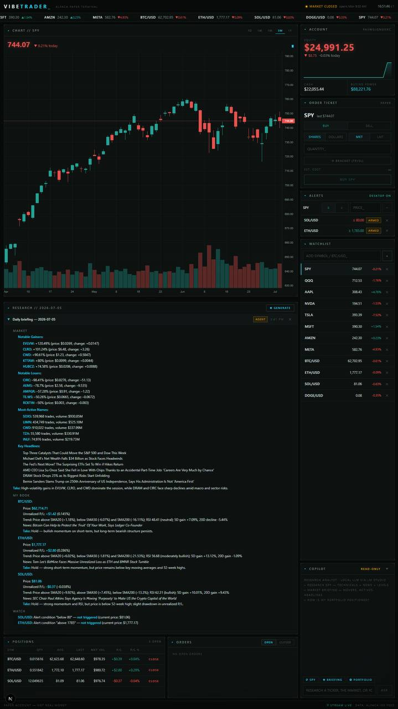
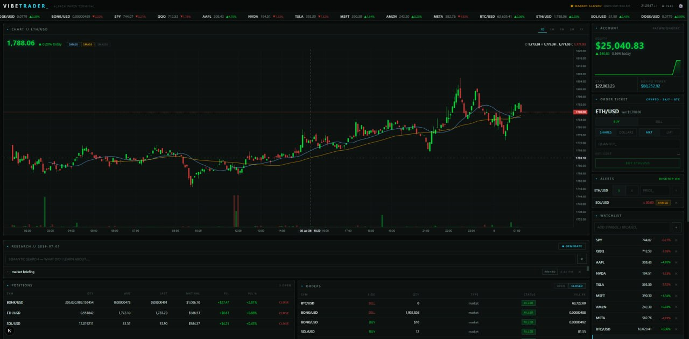

# VIBETRADER

A dark, CRT-flavored **AI-assisted paper-trading terminal** for [Alpaca](https://alpaca.markets), with a local-LLM research copilot powered by [LM Studio](https://lmstudio.ai).





> **Paper trading only.** VIBETRADER is for learning, research workflows, and local experimentation. It is not financial advice, not a signal service, and not built for unattended real-money trading.

## What it does

VIBETRADER combines a trading dashboard, market-data terminal, and local AI research workflow:

- Stream Alpaca paper account, quote, candle, order, and position data
- Watch stocks and crypto in one interface
- Place paper market, limit, and bracket orders with safety confirmations
- Research symbols with a local LLM copilot using read-only tools
- Generate daily briefings from deterministic market/news data
- Trigger alert-based research when watched prices move
- Keep local research and trade journals
- Review performance, equity curve, win rate, and trade history

## Features

### Trading terminal

- Live streaming quotes, candles, and order fills through a server-side websocket relay → SSE
- Candlestick chart with SMA 20/50/200 overlays and volume
- Click-anywhere price alerts with desktop notifications and sound
- Market, limit, and bracket orders
- One-click position close with arm/confirm safety
- Stocks + crypto watchlist and ticker tape

### AI layer — local first

- Research copilot powered by LM Studio's OpenAI-compatible local server
- Read-only tools for account, positions, orders, quotes, technicals, news, and screeners
- Daily briefing generator: deterministic data gathering, LLM synthesis only
- Alert-triggered auto-research: alert fires → agent researches why → note lands in journal
- News watchdog that triages stories touching watched symbols
- Research journal with local semantic search
- Trade journal capturing market-context snapshots at fill time

### Dashboards

- Account overview
- Positions and orders
- Watchlist and alerts
- Research panel
- Performance page: equity vs SPY, FIFO round-trip stats, win rate, per-symbol P/L, trade log
- Settings page for API keys, model selection, watchdog settings, and UI theme customization

## Safety model

VIBETRADER is intentionally conservative about AI authority:

- Alpaca keys stay server-side and are never sent to the browser.
- The LLM research tools are read-only.
- Broad tasks gather data deterministically first; the model synthesizes, it does not invent prices or indicators.
- Technical indicators are computed server-side in code, not by the model.
- Real-money trading is not the target use case.

## Quick start

### 1. Clone and install

```bash
git clone https://github.com/Poseyv12/vibetrader.git
cd vibetrader
npm install
```

### 2. Add Alpaca paper keys

Create a local env file:

```bash
cp .env.example .env.local
```

Then fill in:

```bash
ALPACA_API_KEY=PK...
ALPACA_SECRET_KEY=...
```

Get free paper keys from the [Alpaca paper dashboard](https://app.alpaca.markets).

### 3. Optional: start LM Studio

Install [LM Studio](https://lmstudio.ai), then load:

- a tool-capable chat model, such as Qwen3-4B or similar
- `nomic-embed-text` for local journal search

Start the local server from LM Studio's Developer tab.

Defaults:

```bash
LMSTUDIO_URL=http://localhost:1234/v1
LMSTUDIO_MODEL=qwen/qwen3-4b-2507
LMSTUDIO_EMBED_MODEL=text-embedding-nomic-embed-text-v1.5
```

The app still runs without LM Studio; AI features will tell you to start the server.

### 4. Run locally

```bash
npm run dev
```

Open:

```text
http://localhost:3100
```

## Scripts

```bash
npm run dev      # Start Next.js dev server on port 3100
npm run lint     # Run ESLint
npm run build    # Build production bundle
npm run start    # Start production server
```

## Project structure

```text
app/                 Next.js App Router pages and API routes
components/          Dashboard panels and UI components
hooks/               Polling and streaming hooks
lib/                 Alpaca clients, LLM tools, research, alerts, settings, streams
public/              Public assets and screenshots
data/                Runtime state; gitignored and local-only
```

## Environment

See [.env.example](.env.example).

```bash
ALPACA_API_KEY=...
ALPACA_SECRET_KEY=...
LMSTUDIO_URL=http://localhost:1234/v1
LMSTUDIO_MODEL=qwen/qwen3-4b-2507
LMSTUDIO_EMBED_MODEL=text-embedding-nomic-embed-text-v1.5
```

## Notes

- Free-tier Alpaca market data uses the IEX feed.
- Alpaca crypto streams 24/7.
- Alpaca enforces a $10 minimum on crypto orders and takes crypto fees in the base asset.
- Bracket orders are equities-only.
- Runtime state lives in `data/` and is gitignored.
- Small local models are useful for grounded synthesis, but weak at math. Indicators are computed in code.

## Roadmap

- [ ] Better onboarding flow for first-time users
- [ ] More screenshots and short demo GIF
- [ ] GitHub Actions CI
- [ ] Import/export research journal
- [ ] More transparent AI tool-call audit trail
- [ ] Strategy backtesting sandbox for paper-only experiments

## Contributing

Contributions are welcome. Start with [CONTRIBUTING.md](CONTRIBUTING.md).

Good first areas:

- README/docs improvements
- UI polish
- safer paper-trading workflows
- test coverage
- local-model prompt improvements
- accessibility and keyboard navigation

## Security

Never commit `.env.local`, API keys, or runtime `data/` files. See [SECURITY.md](SECURITY.md) for reporting and safety guidance.

## Stack

Next.js App Router · TypeScript · lightweight-charts · Alpaca REST + websockets · LM Studio/OpenAI-compatible local APIs · SSE relay

## License

MIT — see [LICENSE](LICENSE).
