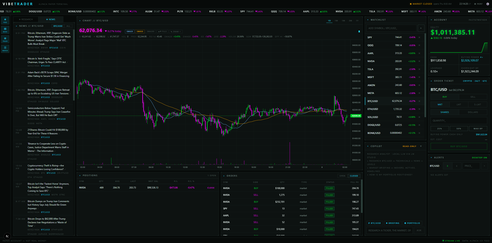
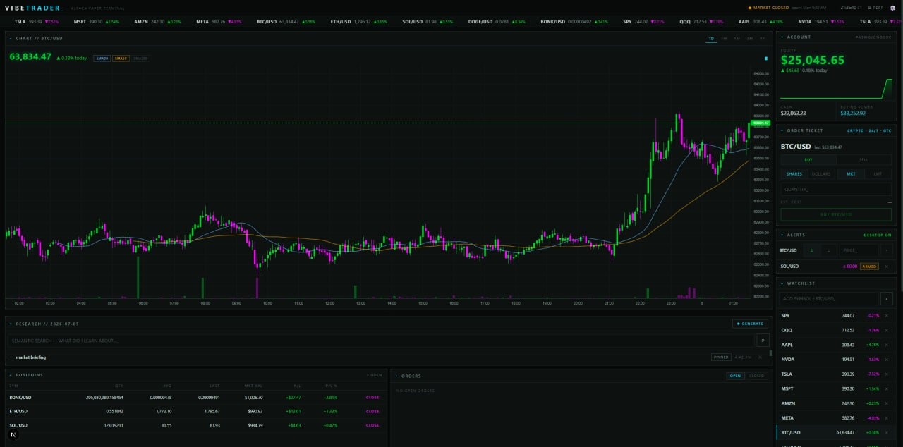
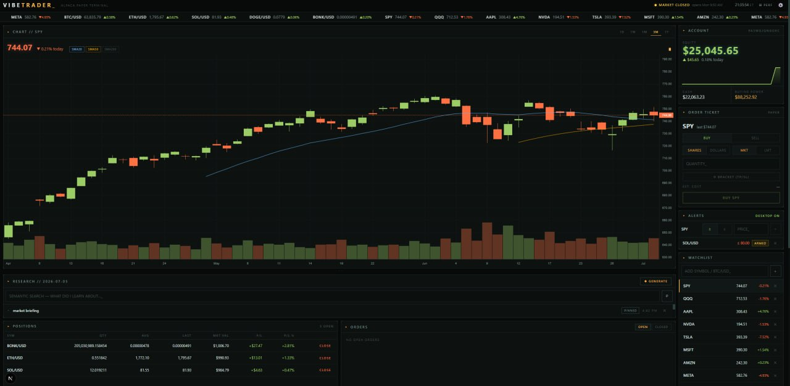

# VIBETRADER

A dark, CRT-flavored **AI-assisted paper-trading terminal** for [Alpaca](https://alpaca.markets), with an AI research copilot — local via [LM Studio](https://lmstudio.ai) by default, switchable to OpenAI or Anthropic frontier models.



### Colorway examples





> **Paper trading only.** VIBETRADER is for learning, research workflows, and local experimentation. It is not financial advice, not a signal service, and not built for unattended real-money trading... Yet.

## What it does

VIBETRADER combines a trading dashboard, market-data terminal, and AI research workflow:

- Stream Alpaca paper account, quote, candle, order, and position data in real time
- Watch stocks and crypto in one interface
- Place paper market, limit, stop, stop-limit, trailing-stop, and bracket orders with safety confirmations
- Manage working orders directly on the chart — drag lines to stage exits or re-price
- Research symbols with an LLM copilot using read-only tools, from a command line in the header
- Draft trades with AI — a watchlist scout and copilot proposals load the ticket, you always confirm
- Generate daily briefings and AI trade reviews from deterministic market/trade data
- Trigger alert-based research when watched prices move
- Triage live news for watched symbols
- Keep local research and trade journals
- Review performance, equity curve, win rate, and trade history

## Features

### Trading terminal

- Real-time prices through a server-side websocket relay → SSE: trades, bid/ask mid-quotes, and candles move the chart, ticker tape, and position P&L live between polls
- Candlestick chart with SMA 20/50/200 overlays, volume, 1D–5Y ranges, and a bar-resolution picker (1m to 1W, with per-range AUTO presets) plus a next-bar countdown
- Chart stats strip: day O/H/L, volume, RSI14, distance vs SMA20/50, 5D/20D change, 30-day realized vol, 52-week range
- Drawing tools: trendlines, rays, horizontal lines, and Fibonacci retracements
- Manage orders on the chart: drag from the entry line to stage a take-profit or stop-loss, drag a working order line to re-price it, click a line to close the position or cancel the order — nothing transmits until you confirm
- Position entry, working orders, and alert levels overlaid on the chart, with journaled fills plotted as arrows
- Click-anywhere price alerts with desktop notifications and sound
- Market, limit, stop, stop-limit, trailing-stop, and bracket orders
- Margin-aware trading: leverage, intraday vs overnight buying power, cash-only asset handling
- One-click position close with arm/confirm safety
- Stocks + crypto watchlist and ticker tape
- Wide-screen cockpit layout with a panel-visibility rail and fullscreen toggle; selected symbol persists across reloads

### AI layer — local first, frontier optional

- Research copilot: LM Studio's local server by default, switchable to OpenAI or Anthropic on the settings page
- Header command line — ask the copilot anything from anywhere in the terminal
- Read-only tools for account, positions, orders, quotes, technicals, news, screeners, and performance stats
- AI trade drafting: a scout scans the watchlist for setups and the copilot can propose trades — drafts load the order ticket, and you always arm + confirm before anything transmits
- Daily briefing generator: deterministic data gathering, LLM synthesis only
- AI trade review: server-computed FIFO stats plus fill-time market snapshots, synthesized into a scorecard and habit critique
- Alert-triggered auto-research: alert fires → agent researches why → note lands in journal
- News watchdog that triages stories touching watched symbols
- Research journal with local semantic search
- Trade journal capturing market-context snapshots (RSI, SMA distance, 5-day change) at fill time

### Dashboards

- Account overview with leverage and buying-power readout
- Positions and orders
- Watchlist and alerts
- Research panel and tabbed news panel with a live triage stream
- Performance page: equity vs SPY, FIFO round-trip stats, win rate, per-symbol P/L, trade log, and one-click AI review
- Settings page for API keys, AI provider and model selection, watchdog settings, and UI theme customization

## Safety model

VIBETRADER is intentionally conservative about AI authority:

- Alpaca and AI-provider keys stay server-side and are never sent to the browser.
- The LLM research tools are read-only. The one exception is draft-shaped: `propose_trade` and the scout only stage a draft in the order ticket — the user must still arm and confirm before anything transmits.
- Broad tasks gather data deterministically first; the model synthesizes, it does not invent prices or indicators.
- Technical indicators are computed server-side in code, not by the model.
- Real-money trading is not the target use case.

## Quick start

### 1. Clone and install

```bash
git clone https://github.com/Poseyv12/vibetrader.git
cd vibetrader
npm install
```

### 2. Add Alpaca paper keys

Create a local env file:

```bash
cp .env.example .env.local
```

Then fill in:

```bash
ALPACA_API_KEY=PK...
ALPACA_SECRET_KEY=...
```

Get free paper keys from the [Alpaca paper dashboard](https://app.alpaca.markets).

### 3. Optional: pick an AI provider

**LM Studio (default, local).** Install [LM Studio](https://lmstudio.ai), then load:

- a tool-capable chat model, such as Qwen3-4B or similar
- `nomic-embed-text` for local journal search

Start the local server from LM Studio's Developer tab.

Defaults:

```bash
LMSTUDIO_URL=http://localhost:1234/v1
LMSTUDIO_MODEL=qwen/qwen3-4b-2507
LMSTUDIO_EMBED_MODEL=text-embedding-nomic-embed-text-v1.5
```

**OpenAI or Anthropic (frontier models).** Switch the provider and add an API
key on the `/settings` page (or set `LLM_PROVIDER`, `OPENAI_API_KEY` /
`ANTHROPIC_API_KEY` in `.env.local`). Journal embeddings always use LM Studio
locally, regardless of chat provider.

The app still runs without any AI provider; AI features will tell you what to configure.

### 4. Run locally

```bash
npm run dev
```

Open:

```text
http://localhost:3100
```

## Scripts

```bash
npm run dev      # Start Next.js dev server on port 3100
npm run lint     # Run ESLint
npm run build    # Build production bundle
npm run start    # Start production server
```

## Project structure

```text
app/                 Next.js App Router pages and API routes
components/          Dashboard panels and UI components
hooks/               Polling and streaming hooks
lib/                 Alpaca clients, LLM tools, research, alerts, settings, streams
public/              Public assets and screenshots
data/                Runtime state; gitignored and local-only
```

## Environment

See [.env.example](.env.example).

```bash
ALPACA_API_KEY=...
ALPACA_SECRET_KEY=...
LMSTUDIO_URL=http://localhost:1234/v1
LMSTUDIO_MODEL=qwen/qwen3-4b-2507
LMSTUDIO_EMBED_MODEL=text-embedding-nomic-embed-text-v1.5
LLM_PROVIDER=lmstudio        # lmstudio | openai | anthropic
OPENAI_API_KEY=...           # only if LLM_PROVIDER=openai
ANTHROPIC_API_KEY=...        # only if LLM_PROVIDER=anthropic
```

All of these, including the Alpaca keys, can also be configured on the `/settings` page.

## Notes

- Free-tier Alpaca market data uses the IEX feed.
- Alpaca crypto streams 24/7.
- Alpaca enforces a $10 minimum on crypto orders and takes crypto fees in the base asset.
- Bracket orders are equities-only; crypto and fractional/notional orders are cash-only (non-marginable).
- Margin is account-level: intraday buying power is up to 4× (equity ≥ $25k), overnight holds must fit 2×.
- Runtime state lives in `data/` and is gitignored.
- Small local models are useful for grounded synthesis, but weak at math. Indicators are computed in code.

## Roadmap

- [ ] Better onboarding flow for first-time users
- [ ] More screenshots and short demo GIF
- [ ] GitHub Actions CI
- [ ] Import/export research journal
- [ ] More transparent AI tool-call audit trail
- [ ] Strategy backtesting sandbox for paper-only experiments

## Contributing

Contributions are welcome. Start with [CONTRIBUTING.md](CONTRIBUTING.md).

Good first areas:

- README/docs improvements
- UI polish
- safer paper-trading workflows
- test coverage
- local-model prompt improvements
- accessibility and keyboard navigation

## Security

Never commit `.env.local`, API keys, or runtime `data/` files. See [SECURITY.md](SECURITY.md) for reporting and safety guidance.

## Stack

Next.js App Router · TypeScript · lightweight-charts · Alpaca REST + websockets · LM Studio / OpenAI / Anthropic AI providers · SSE relay

## License

MIT — see [LICENSE](LICENSE).
